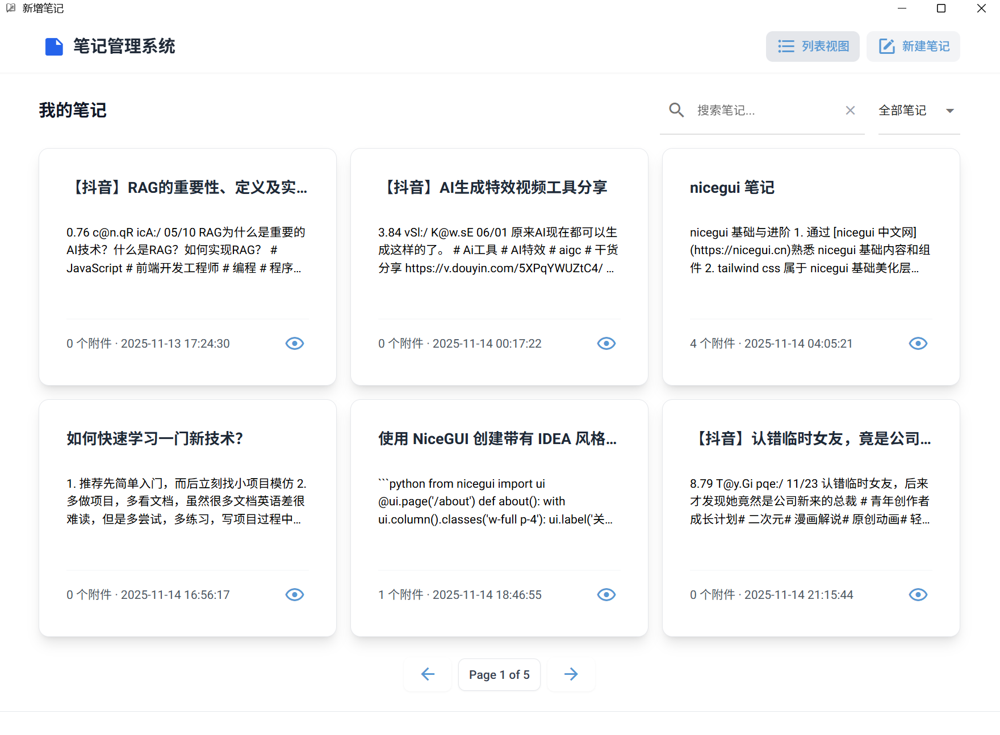
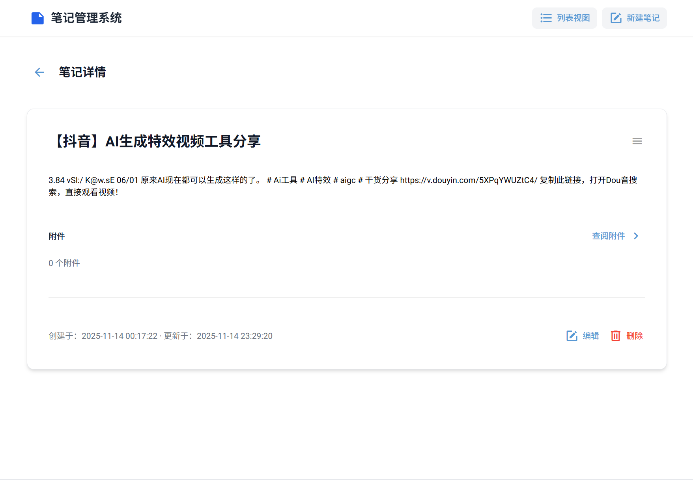

# 笔记管理系统（桌面版）

一个本地笔记管理桌面应用，基于 Python Nicegui 框架开发，适用于个人知识整理与日常记录。

## 功能特性

- 新建笔记、编辑笔记、附件上传、ai 生成标题
- 列表视图支持分页、筛选、排序
- 笔记详情页，笔记支持 label 和 markdown 格式渲染，label 类似于记事本，markdown 可以渲染基础 markdown 语法

## 安装指南

访问 [uv 中文文档](https://uv.doczh.com/getting-started/installation/) 下载 uv

打开当前项目根目录，执行：

```bash
uv init # 初始化项目
uv venv .venv # 创建虚拟环境
uv sync # 下载依赖库
uv run ./main.py --native # 运行项目
```

注意事项：

- ai 生成标题功能调用了 deepseek api，需要在根目录下创建 .env 文件，填充 DEEPSEEK_API_KEY 字段

## 项目结构

```txt
.
├── main.py                 # 应用入口
├── models.py               # 数据库模型
├── schemas.py              # Pydantic 模型
├── services.py             # 业务逻辑
├── api.py                  # API 路由
├── migrations/             # 数据库迁移脚本
├── alembic.ini             # Alembic 配置
├── settings.py             # 配置管理
├── utils.py                # 工具函数
└── README.md
```

## 项目预览

**主页**：


**笔记详情**：


**编辑笔记**：


**新建笔记**：


## 开发感想

本项目源于个人需求，旨在锻炼普通的全栈开发能力，包括：

- 前后端协同开发（NiceGUI + FastAPI）
- 数据库设计与迁移（SQLAlchemy + Alembic）
- AI 辅助开发（使用 Coze 扣子 生成初始 UI 设计）
- 桌面应用打包与部署实践

尽管 NiceGUI 非常适合快速构建 Web 式界面，但在桌面应用场景下（尤其是启动速度）存在一定局限。

虽然 NiceGUI 难登大雅之堂（这个难包括框架设计和复杂页面的复杂度等），而且本人对前端和桌面应用开发方便没有系统性学习过，
但是不论项目结构如何、代码质量如何，一个真正能运行起来的可用的软件才是关键。先不论好用与否，只要能用，对于开发者来说整个
项目经历是有意义的。总而言之，一个能运行起来的项目才是关键，一切优化可以之后再提（况且不提那又如何呢？）

---

- 强业务相关的项目开发会消耗热情，尤其 web 开发方面，需要多多思考出路
- 强业务项目的代码如果绕不过，建议多去提升设计、架构、全局方面的能力
- 很多程序功能都不是一蹴而就的，都是在测试和开发的过程中迭代的，莫要妄自菲薄，也莫要目中无人
- **再次强调**，尽量远离业务，多思考其他出路，如算法、系统开发等
- 技术和框架是学不完的，要拿实际需求配合官方文档来掌握（不要只攻技术，多看点非技术的书）

---

- 解决问题除了 ai 还有官方文档（搜索引擎现在已经没什么用了，就这两个搭配即可），nicegui 英文官网更详细，中文官网时效性不够
- nicegui 绝对可以实现出很好的页面（需要前端基础，想进阶还得找专用语言学习，学完才能反过来用 nicegui 实现更好的页面）
- nicegui 官方文档、github 页面、组件涉及的组件官方（因为 nicegui 封装了很多前端组件库，都有自己的官网）等都值得阅读
    - 官网：文档、案例、更详细的介绍（可惜英语不够好，理解吃力）
    - github 页面：社区生态、第三方依赖库
    - 关联组件官网：很多专业组件，如 echarts 等

---

- 出现不得不 `from a import (b, c, d)` 的情况即可考虑拆分被导入的文件或者导入的文件