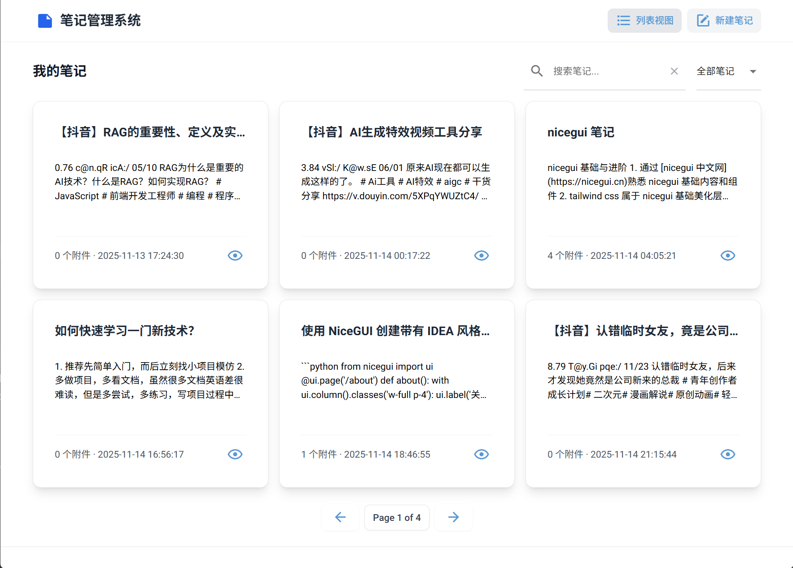

# 笔记管理系统（桌面版）

一个本地笔记管理桌面应用，基于 Python Nicegui 框架开发，适用于个人知识整理与日常记录。

## 功能特性

- 新建笔记、编辑笔记、附件上传、ai 生成标题
- 列表视图支持分页、筛选、排序
- 笔记详情页，笔记支持 label 和 markdown 格式渲染，label 类似于记事本，markdown 可以渲染基础 markdown 语法



## 项目结构
```txt
.
├── main.py                 # 应用入口
├── models.py               # 数据库模型
├── schemas.py              # Pydantic 模型
├── services.py             # 业务逻辑
├── api.py                  # API 路由
├── migrations/             # 数据库迁移脚本
├── alembic.ini             # Alembic 配置
├── settings.py             # 配置管理
├── utils.py                # 工具函数
└── README.md
```

## 安装指南

访问 [uv 中文文档](https://uv.doczh.com/getting-started/installation/) 下载 uv

打开当前项目根目录，执行：
```bash
uv init # 初始化项目
uv venv .venv # 创建虚拟环境
uv sync # 下载依赖库
uv run ./main.py --native # 运行项目
```

注意事项：
- ai 生成标题功能调用了 deepseek api，需要在根目录下创建 .env 文件，填充 DEEPSEEK_API_KEY 字段


## 开发感想

本项目源于个人需求，旨在锻炼普通的全栈开发能力，包括：
- 前后端协同开发（NiceGUI + FastAPI）
- 数据库设计与迁移（SQLAlchemy + Alembic）
- AI 辅助开发（使用 Coze 扣子 生成初始 UI 设计）
- 桌面应用打包与部署实践

尽管 NiceGUI 非常适合快速构建 Web 式界面，但在桌面应用场景下（尤其是启动速度）存在一定局限。


